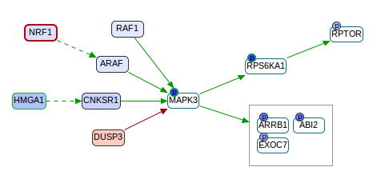

# CausalPath
This is a tool for pathway analysis of proteomic and phosphoproteomic datasets. CausalPath aims to identify mechanistic pathway relations that can explain observed correlations in experiments. In the below example, the mesenchymal subtype of ovarian cancer is compared against other subtypes. This graph is focused on the downregulation of MAPK3 in this subtype, suggesting several mechanisms that probably caused it (upstream), and showing its likely downstream effect.



To analyze your dataset, please visit our **[web-service](http://104.198.75.85:3001/)** that runs an instance of CausalPath.

Alternatively, users can locally run the Java code in this project on their datasets, and visualize the results in [ChiBE](https://github.com/PathwayCommons/chibe). But in both cases, to use this tool, users need to [prepare input files](wiki/InputFormat.md) to feed into the analysis.

To get a copy of the project and build it, first make sure you have [git](https://git-scm.com/downloads), [maven](https://maven.apache.org/download.cgi) and [JDK8](http://www.oracle.com/technetwork/java/javase/downloads/jdk8-downloads-2133151.html) in your system, then while in your projects folder, do:
```
git pull https://github.com/PathwayAndDataAnalysis/causalpath.git
cd causalpath
mvn clean install
mvn assembly:single
```
The last command should create `causalpath.jar` under `causalpath/target` directory. Then you can run the code by
```
java -jar target/causalpath.jar path/to/input/directory
```
The input directory has to contain a `parameters.txt` file which provides the necessary parameters and links to the input data files. Please refer to [this page](wiki/InputFormat.md) for preparation of inputs.

After CausalPath runs on your input data, it generates output in the same input directory where the `parameters.txt` is. Among those output files, `causal.sif` and `causal.format` are two files that ChiBE needs for displaying the result graph. To display, please open ChiBE and from the menu, do `SIF -> Load SIF File`. Navigate to the directory and select `causal.sif`. 

A manuscript for this method is under evaluation.
